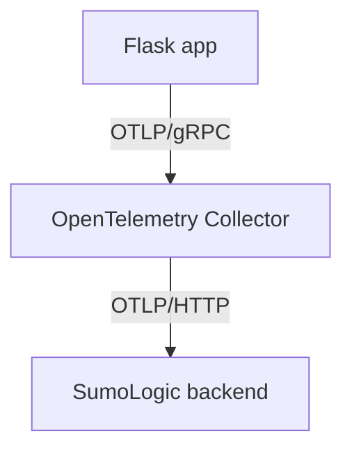

# SumoLogic OpenTelemetry Proof of Concept
A simple Flask app that publishes metrics to SumoLogic.

## Requirements
You will need docker and docker-compose installed to run this app

## Getting Up and Running
1. Run `make env` to generate an `.env` file.
2. Add real values for `SUMOLOGIC_INSTALL_TOKEN` and `OTEL_EXPORTER_OTLP_ENDPOINT` in `.env`. You might also want to change the value of `OTEL_SERVICE_NAME`.
3. Run `make up`. This should bring up 2 containers: one with the flask app and the other with the SumoLogic collector.
4. Navigate in your web browser to `http://127.0.0.1:5020` to visit the flask app, which generates a counter metrics.
5. You can examine the logs of the app using `docker-compose logs demo-server` and the logs of the collector using `docker-compose logs otel-collector`.
